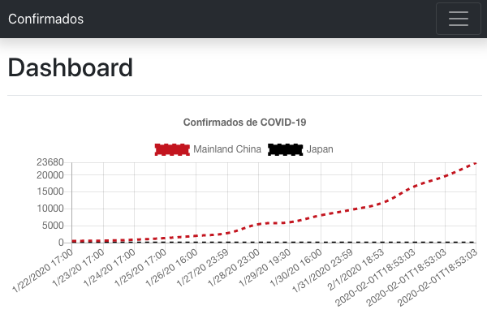

# [WIP] 🦠 Confirmados do COVID-19


## Confirmados

É um projeto simples, e ele existe para ajudar pessoas que tiveram um Acidente Vascular Cerebral, que comprometeu uma parte de vocabulário. O projeto mostra com os Confirmados do COVID-19 em um Gráfico de linhas ente Tempo x Confirmados.



## Gráfico

Confirmados pelo COVID-19 pelo período x confirmados.

# Como usar o projeto (MacOS).

## Requisitos

- Brew
- Yarn

## Configurações

1. Instalar o projeto
```shell
# make install
```
2. Atulizando os dados pelos dados da JHU CSSE.
```shell
# make bd_update
```
3. Integragrando com os dados para o Site.
```shell
# make itgt_start
``` 
# 4. Iniciando o site
```shell
# make site_start
```
# 5. Atualizar o site(dados, site)
```shell
# make update
```

--------------

## Referências

Novel Coronavirus (COVID-19) Cases, provided by JHU CSSE: https://systems.jhu.edu/research/public-health/ncov/

Brazil Ministry of Health: https://covid.saude.gov.br/

National Health Commission Update: http://weekly.chinacdc.cn/news/TrackingtheEpidemic.htm

NYC Department of Health and Mental Hygiene: https://github.com/nytimes/covid-19-data

Bootstrap: https://getbootstrap.com/

Yarn pkg: https://classic.yarnpkg.com/en/docs/

Webpack: https://webpack.js.org/

Create React App: https://github.com/facebook/create-react-app

React wrapper for Chart.js: https://github.com/jerairrest/react-chartjs-2

Chart.js: https://www.chartjs.org/

Scheme Color: https://www.schemecolor.com/

Mastering Markdown: https://guides.github.com/features/mastering-markdown/

ISO 8601 Date and Time format: https://www.iso.org/iso-8601-date-and-time-format.html

TDD: https://pt.wikipedia.org/wiki/Test-driven_development

Jest is a delightful JavaScript Testing Framework with a focus on simplicity. https://jestjs.io

Funções assíncronas: https://developer.mozilla.org/pt-BR/docs/Web/JavaScript/Reference/Statements/funcoes_assincronas

Awesome Coronavirus: https://corona.js.org/

Oh My Zsh is an open source, community-driven framework for managing your zsh configuration.: https://github.com/ohmyzsh/ohmyzsh

jsontools: https://github.com/ohmyzsh/ohmyzsh/tree/master/plugins/jsontools

Algoritmo de ordenação: https://pt.wikipedia.org/wiki/Algoritmo_de_ordena%C3%A7%C3%A3o

Introdução ao Shell Script no Linux: https://www.devmedia.com.br/introducao-ao-shell-script-no-linux/25778 Acesso em 19/09/2020