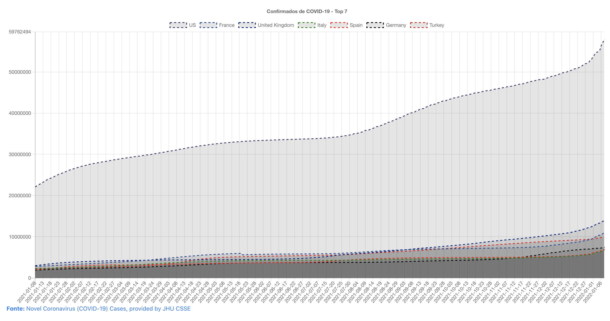

# [WIP] 🦠 Confirmados do COVID-19


## Confirmados

O ***Confirmados*** tem o objetivo de mostrar um site que tem um gráfico com os dados de confirmações do COVID-19 pelo tempo.\
A importância desse projeto é para treinamento de uso das palavras e conhecimento resgatados da memória.\
Eu tive um derrame cerebral (AVE-He) que comprometeu uma parte do meu cérebro ocasionando uma lesão que afeta a área responsável pela linguagem, ou seja, eu tenho o distúrbio da Afasia de Wernicke. É uma alteração na linguagem oral e escrita, tornando a comunicação sem muita precisão.

## Gráfico

### Top7 - Mundo


Confirmados pelo COVID-19 pelo período x confirmados.

# Como usar o projeto (MacOS).

## Requisitos

- Brew https://brew.sh/index_pt-br
- Yarn https://yarnpkg.com/

## Configurações

0. Dados pra testar

```javascript
/// loadTest.js

const start = new Date("2020-12-08T00:00:00.000")
const end = new Date("2021-12-08T23:59:59.999")

const top7 = new Load(
    "Top 7",
    [
        us,
        germany,
        uk,
        russia,
        france,
        turkey,
        poland
    ],
    init,
    end
)
```

1. Instalar o projeto
```shell
# make install
```
2. Atulizando os dados pelos dados da JHU CSSE.
```shell
# make bd_update
```
3. Integragrando com os dados para o Site.
```shell
# make itgt_start
``` 
4. Iniciando o site
```shell
# make site_start
```
5. Atualizar o site
```shell
# make update
```

--------------

## Ferramentas

Adobe Color: https://color.adobe.com/pt/create/color-wheel 

Scheme Color: https://www.schemecolor.com/

--------------

## Referências

*covid-19*

Novel Coronavirus (COVID-19) Cases, provided by JHU CSSE: https://systems.jhu.edu/research/public-health/ncov/

Our Worldin Data: https://ourworldindata.org/about Acessado em 13/07/2021

Brazil Ministry of Health: https://covid.saude.gov.br/

National Health Commission Update: http://weekly.chinacdc.cn/news/TrackingtheEpidemic.htm

NYC Department of Health and Mental Hygiene: https://github.com/nytimes/covid-19-data

Awesome Coronavirus: https://corona.js.org/

JSON time-series of coronavirus cases (confirmed, deaths and recovered) per country - updated daily: https://github.com/pomber/covid19 Acesso em 28/11/2020

*Markdown*

Mastering Markdown: https://guides.github.com/features/mastering-markdown/

*Testes*

TDD: https://pt.wikipedia.org/wiki/Test-driven_development

Jest is a delightful JavaScript Testing Framework with a focus on simplicity. https://jestjs.io

*Javascript*

Promise: https://developer.mozilla.org/pt-BR/docs/Web/JavaScript/Reference/Global_Objects/Promise

Como escrever um código assíncrono em Node.js: https://www.digitalocean.com/community/tutorials/how-to-write-asynchronous-code-in-node-js-pt

Bootstrap: https://getbootstrap.com/

Yarn pkg: https://classic.yarnpkg.com/en/docs/

Webpack: https://webpack.js.org/

Create React App: https://github.com/facebook/create-react-app

React wrapper for Chart.js: https://github.com/jerairrest/react-chartjs-2

Chart.js: https://www.chartjs.org/

ISO 8601 Date and Time format: https://www.iso.org/iso-8601-date-and-time-format.html

jsontools: https://github.com/ohmyzsh/ohmyzsh/tree/master/plugins/jsontools

Funções assíncronas: https://developer.mozilla.org/pt-BR/docs/Web/JavaScript/Reference/Statements/funcoes_assincronas

*Ciência da computação*

Algoritmo de ordenação: https://pt.wikipedia.org/wiki/Algoritmo_de_ordena%C3%A7%C3%A3o

*Bash*

Oh My Zsh is an open source, community-driven framework for managing your zsh configuration.: https://github.com/ohmyzsh/ohmyzsh

Introdução ao Shell Script no Linux: https://www.devmedia.com.br/introducao-ao-shell-script-no-linux/25778 Acesso em 19/09/2020

How to delete a file in bash: https://linuxhint.com/delete_file_bash/ Acesso em 14/11/2020

*Saúde*

11 coisas que você não sabe sobre o AVC - https://saude.abril.com.br/medicina/11-coisas-que-voce-nao-sabe-sobre-o-avc/ Acesso em 04/10/2020

*História*

União de Kalmar - https://pt.wikipedia.org/wiki/União_de_Kalmar Acesso em 05/12/2020