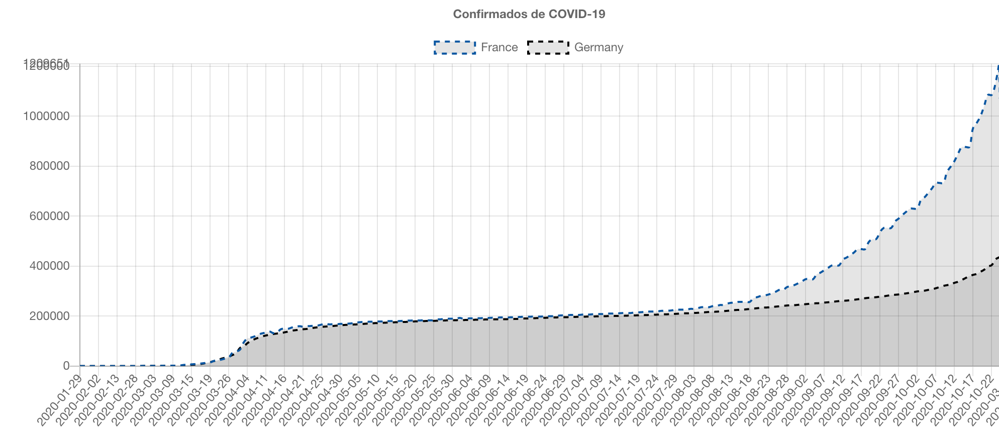

# [WIP] 🦠 Confirmados do COVID-19


## Confirmados

É um projeto simples, ele existe para estudar, tanto pra uma pessoa iniciante ou pessoas que tiveram um 🧠 Acidente Vascular Cerebral, que comprometeu uma parte de vocabulário. O projeto mostra um Confirmados em um Gráfico de linhas ente Tempo x Confirmados.



## Gráfico

Gráfico simples período x confirmados.

## Atualizar

Atualizar os dados.

--------------

### Implementando

Requisitos

``` # npm install -g yarn ```

Instalar

``` # make install ```

start (Iniciando o Site)

``` # make start```

integrate install

``` # make itgt_install ``` 

integrate start

``` # make itgt_start ```

integrate test

``` # make itgt_test ```

--------------

## Referências

Novel Coronavirus (COVID-19) Cases, provided by JHU CSSE: https://systems.jhu.edu/research/public-health/ncov/

Brazil Ministry of Health: https://covid.saude.gov.br/

National Health Commission Update: http://weekly.chinacdc.cn/news/TrackingtheEpidemic.htm

NYC Department of Health and Mental Hygiene: https://github.com/nytimes/covid-19-data

Bootstrap: https://getbootstrap.com/

Yarn pkg: https://classic.yarnpkg.com/en/docs/

Webpack: https://webpack.js.org/

Create React App: https://github.com/facebook/create-react-app

React wrapper for Chart.js: https://github.com/jerairrest/react-chartjs-2

Chart.js: https://www.chartjs.org/

Scheme Color: https://www.schemecolor.com/

Mastering Markdown: https://guides.github.com/features/mastering-markdown/

ISO 8601 Date and Time format: https://www.iso.org/iso-8601-date-and-time-format.html

TDD: https://pt.wikipedia.org/wiki/Test-driven_development

Jest is a delightful JavaScript Testing Framework with a focus on simplicity. https://jestjs.io

Funções assíncronas: https://developer.mozilla.org/pt-BR/docs/Web/JavaScript/Reference/Statements/funcoes_assincronas

Awesome Coronavirus: https://corona.js.org/

Oh My Zsh is an open source, community-driven framework for managing your zsh configuration.: https://github.com/ohmyzsh/ohmyzsh

jsontools: https://github.com/ohmyzsh/ohmyzsh/tree/master/plugins/jsontools

Algoritmo de ordenação: https://pt.wikipedia.org/wiki/Algoritmo_de_ordena%C3%A7%C3%A3o